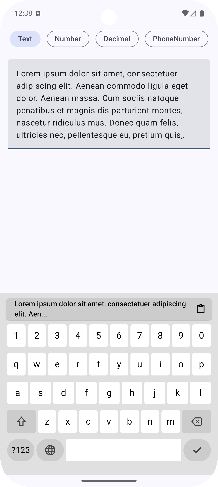
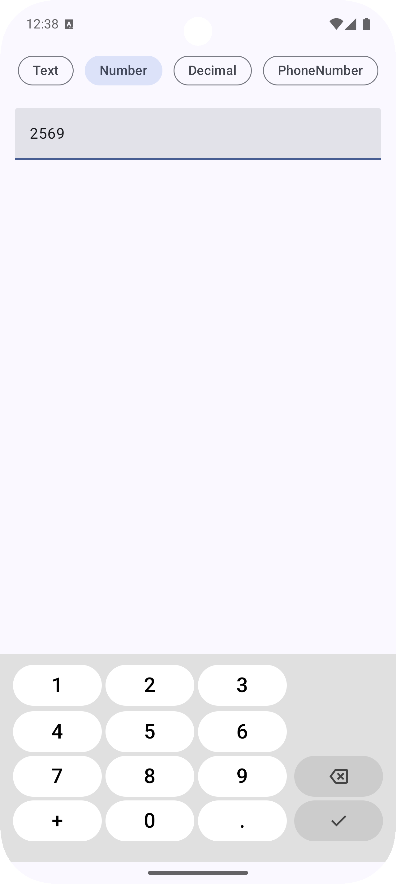
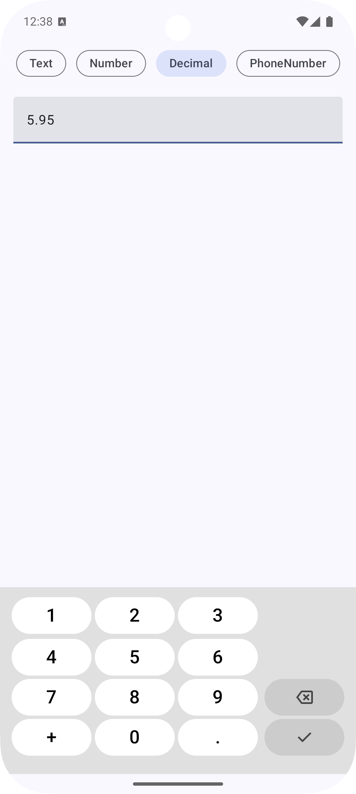
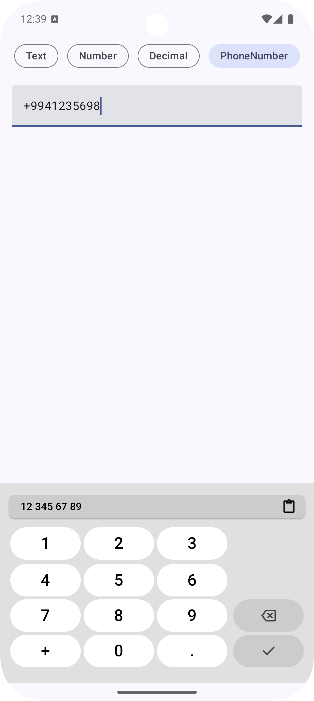

# Android In-App Keyboard

A secure custom in-app keyboard implementation for Android applications built with Jetpack Compose, designed to protect user input from malicious third-party keyboards and logging attacks.

## 📱 Demo & Screenshots

### Live Demo


### Keyboard Types

<div align="center">
  <table>
    <tr>
      <td align="center">
        
        <br/>
        <b>Text Input</b>
        <br/>
        Multi-language QWERTY layout
      </td>
      <td align="center">
        
        <br/>
        <b>Number Input</b>
        <br/>
        Numeric keypad layout
      </td>
    </tr>
    <tr>
      <td align="center">
        
        <br/>
        <b>Decimal Input</b>
        <br/>
        Numbers with decimal point
      </td>
      <td align="center">
        
        <br/>
        <b>Phone Number</b>
        <br/>
        Optimized for phone entry
      </td>
    </tr>
  </table>
</div>

## 🔒 Purpose

This project provides a custom keyboard solution that prioritizes security and privacy:

- **Anti-Keylogging Protection**: Prevents malicious third-party keyboards from capturing sensitive user input
- **Zero Trust Approach**: Eliminates dependency on external keyboard applications that may compromise user data
- **In-App Security**: Keeps all input processing within the application boundary
- **Privacy-First Design**: Ensures sensitive information like passwords, PINs, and personal data never leave the app context

## 🚀 How to Run

### Prerequisites
- Android Studio Arctic Fox or newer
- Android SDK API level 24 or higher
- Kotlin 1.8+
- Gradle 8.0+

### Installation Steps

1. **Clone the repository:**
   ```bash
   git clone <repository-url>
   cd android-keyboard-in-app
   ```

2. **Open in Android Studio:**
   - Launch Android Studio
   - Select "Open an existing project"
   - Navigate to the project directory and open it

3. **Build and Run:**
   - Wait for Gradle sync to complete
   - Connect an Android device or start an emulator
   - Click the "Run" button or use `Ctrl+R` (Windows/Linux) or `Cmd+R` (Mac)

### Alternative: Command Line Build
```bash
./gradlew assembleDebug
./gradlew installDebug
```

## ⚙️ Configuration

### Build Configuration
- **Target SDK**: 35
- **Min SDK**: 24
- **Compile SDK**: 35
- **Java Version**: 11
- **Kotlin JVM Target**: 11

### Key Dependencies
- Jetpack Compose BOM
- Material3 Design Components
- Compose UI Toolkit
- Android Core KTX
- Activity Compose

### Keyboard Types Supported
- **Text Input**: Full QWERTY layout with multiple languages
- **Numeric**: Number-only input
- **Decimal**: Numbers with decimal point support
- **Phone Number**: Optimized for phone number entry with + symbol

### Language Support
- **English (EN)**: Standard QWERTY layout
- **Azerbaijani (AZ)**: QWERTY with Azerbaijani-specific characters (ü, ö, ğ, ı, ə, ç, ş)
- **Russian (RU)**: Cyrillic keyboard layout

## 🛡️ Security Features

### Core Security Implementations

1. **Disabled Ripple Effects**:
   - All keyboard keys have ripple effects disabled (`indication = null`)
   - Prevents visual feedback that could be exploited for input monitoring
   - Implemented in `KeyButton` component with `MutableInteractionSource()`

2. **System Keyboard Interception**:
   - Uses `InterceptPlatformTextInput` to completely disable system keyboard
   - Implemented in `DisableSoftKeyboard` composable
   - Ensures no external keyboard can capture input

3. **Haptic Feedback Control**:
   - Controlled haptic feedback using `HapticFeedbackConstants.KEYBOARD_TAP`
   - Provides user feedback without compromising security

4. **Memory Security**:
   - Input handling through `TextFieldValue` with controlled text processing
   - Immediate text processing without external clipboard exposure
   - Secure backspace and text selection handling

5. **Visual Security**:
   - Custom styled keys with controlled visual feedback
   - No external theme dependencies that could be compromised
   - Consistent UI that cannot be mimicked by malicious keyboards

### Input Protection Features

- **Clipboard Security**: Controlled clipboard access with custom `WithClipboardText` component
- **Focus Management**: Secure focus handling to prevent input interception
- **Text Selection**: Protected text selection and editing operations
- **Backspace Security**: Secure character deletion with long-press clear functionality

## 👥 Authors

- **Karim Karimov** - [@kerimovscreations](https://github.com/kerimovscreations)
- **Ulvi Ismayilov** - [@UlvIsmayilov](https://github.com/UlvIsmayilov)
- **Khalida Aliyeva** - [@aliyevakhalida](https://github.com/aliyevakhalida)

## 📄 License

This project is licensed under the MIT License - see below for details:

```
MIT License

Copyright (c) 2025 Karim Karimov, Ulvi Ismayilov, Khalida Aliyeva

Permission is hereby granted, free of charge, to any person obtaining a copy
of this software and associated documentation files (the "Software"), to deal
in the Software without restriction, including without limitation the rights
to use, copy, modify, merge, publish, distribute, sublicense, and/or sell
copies of the Software, and to permit persons to whom the Software is
furnished to do so, subject to the following conditions:

The above copyright notice and this permission notice shall be included in all
copies or substantial portions of the Software.

THE SOFTWARE IS PROVIDED "AS IS", WITHOUT WARRANTY OF ANY KIND, EXPRESS OR
IMPLIED, INCLUDING BUT NOT LIMITED TO THE WARRANTIES OF MERCHANTABILITY,
FITNESS FOR A PARTICULAR PURPOSE AND NONINFRINGEMENT. IN NO EVENT SHALL THE
AUTHORS OR COPYRIGHT HOLDERS BE LIABLE FOR ANY CLAIM, DAMAGES OR OTHER
LIABILITY, WHETHER IN AN ACTION OF CONTRACT, TORT OR OTHERWISE, ARISING FROM,
OUT OF OR IN CONNECTION WITH THE SOFTWARE OR THE USE OR OTHER DEALINGS IN THE
SOFTWARE.
```

## 🔧 Technical Implementation

### Key Components

- **`InAppKeyboard`**: Main keyboard component with full input handling
- **`KeyboardLayout`**: Layout manager for different keyboard types
- **`TextKeyboard`**: Text input keyboard with multi-language support
- **`NumberKeyboard`**: Numeric input keyboards for different number types
- **`DisableSoftKeyboard`**: Security component to disable system keyboard
- **`KeyButton`**: Secure key component with disabled ripple effects

### Architecture

The keyboard is built using a modular architecture with clear separation of concerns:
- Security layer (input interception and protection)
- UI layer (Compose-based keyboard components)
- Input handling layer (text processing and cursor management)
- Language support layer (multi-language character sets)

---

For questions, issues, or contributions, please contact the authors or create an issue in the repository.
